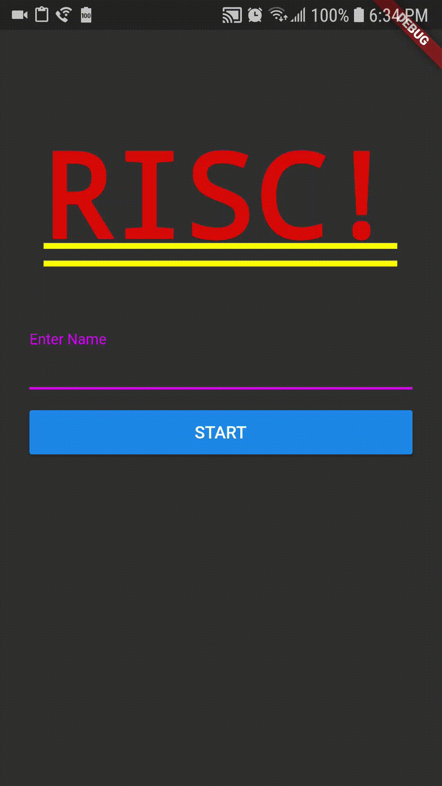
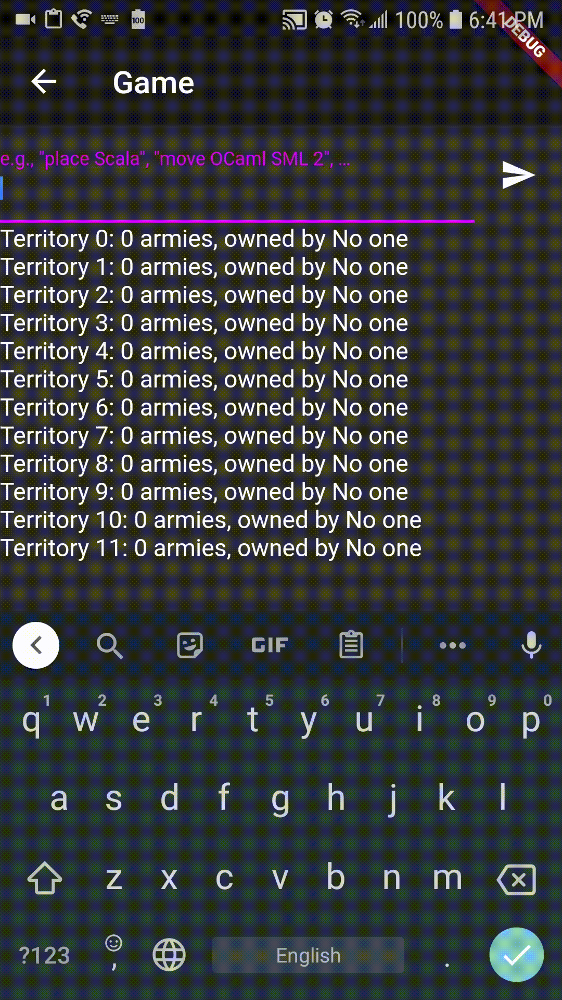

# CS 2340 Risk Mobile

A real-time Risk mobile app. Created for CS 2340 with Dr. Christopher Simpkins, Spring 2019.

## Setup

1. [Install Flutter](https://flutter.dev/docs/get-started/install).
2. On Windows, open Command Prompt and type `ipconfig`, and look at look at Wireless LAN adapter Wi-Fi IPv4 Address. On Linux, type `ip addr` and look at `wifi0: inet`. 
3. Update the line in `main.dart` in the format of `channel = IOWebSocketChannel.connect('ws://[your-ip]:9000/ws');`.
4. Plug in your phone or set up a virtual device.
5. In this directory, run `flutter run`.
6. Start the backend server at [OhadRau/scala-risk](https://github.com/OhadRau/scala-risk).

## Authors

- Michael Chen ([michaelchen21](https://github.com/michaelchen21))
- Hemang Rajvanshy ([HemangRajvanshy](https://github.com/HemangRajvanshy))

## Screenshots

